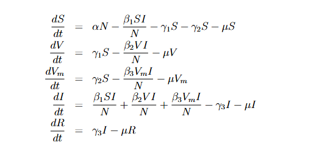

# **Model SIR dengan memperhitungkan dampak vaksinasi dan misinformasi vaksin terhadap penyebaran COVID-19**

---

### **Kompartemen dalam Model**

1. **S (Susceptible)**  
   - Individu yang rentan terhadap infeksi karena belum terinfeksi, belum divaksinasi, atau belum memiliki imunitas.
   - Rentan terhadap infeksi melalui kontak dengan individu yang terinfeksi (I).

2. **V (Vaccinated)**  
   - Individu yang telah divaksinasi dan memiliki kekebalan parsial terhadap penyakit.  
   - Masih memiliki kemungkinan kecil untuk terinfeksi jika terkena paparan.

3. **Vm (Misinformed Susceptible)**  
   - Individu yang rentan terhadap infeksi karena dipengaruhi oleh misinformasi vaksin sehingga menolak vaksinasi.

4. **I (Infected)**  
   - Individu yang terinfeksi COVID-19 dan dapat menularkan penyakit kepada individu rentan (S, V, Vm).

5. **R (Recovered)**  
   - Individu yang telah pulih dari infeksi dan memiliki kekebalan.

6. **N**  
   - Total populasi:  
     `N = S + V + Vm + I + R`

---

### **Persamaan Diferensial Model**

#### 1. **Persamaan untuk Susceptible (S)**  
```
dS/dt = αN - (β1 * S * I)/N - γ1S - γ2S - μS
```
- `αN`: Laju kelahiran populasi baru yang masuk ke S.  
- `(β1 * S * I)/N`: Infeksi yang terjadi pada individu rentan melalui kontak dengan I.  
- `γ1S`: Individu rentan yang beralih ke V karena divaksinasi.  
- `γ2S`: Individu rentan yang beralih ke Vm karena terpengaruh misinformasi.  
- `μS`: Kematian alami pada individu rentan.

#### 2. **Persamaan untuk Vaccinated (V)**  
```
dV/dt = γ1S - (β2 * V * I)/N - μV
```
- `γ1S`: Individu rentan yang divaksinasi.  
- `(β2 * V * I)/N`: Infeksi pada individu yang telah divaksinasi.  
- `μV`: Kematian alami pada individu yang divaksinasi.

#### 3. **Persamaan untuk Misinformed (Vm)**  
```
dVm/dt = γ2S - (β3 * Vm * I)/N - μVm
```
- `γ2S`: Individu rentan yang menjadi kelompok Vm karena misinformasi.  
- `(β3 * Vm * I)/N`: Infeksi pada individu yang menolak vaksin karena misinformasi.  
- `μVm`: Kematian alami pada individu Vm.

#### 4. **Persamaan untuk Infected (I)**  
```
dI/dt = (β1 * S * I)/N + (β2 * V * I)/N + (β3 * Vm * I)/N - γ3I - μI
```
- `(β1 * S * I)/N`: Infeksi dari individu S.  
- `(β2 * V * I)/N`: Infeksi dari individu V.  
- `(β3 * Vm * I)/N`: Infeksi dari individu Vm.  
- `γ3I`: Individu yang pulih dari infeksi.  
- `μI`: Kematian alami atau karena penyakit pada individu yang terinfeksi.

#### 5. **Persamaan untuk Recovered (R)**  
```
dR/dt = γ3I - γR
```
- `γ3I`: Individu yang pulih dari infeksi.  
- `γR`: Kehilangan kekebalan, jika kekebalan tidak bersifat permanen.

---

### **Parameter Penting dalam Model**

- **`β1, β2, β3`**: Tingkat kontak efektif antara individu yang terinfeksi dengan S, V, dan Vm.  
- **`γ1, γ2`**: Laju vaksinasi dan laju terpengaruh misinformasi.  
- **`γ3`**: Laju pemulihan dari infeksi.  
- **`μ`**: Laju kematian alami.  
- **`α`**: Laju kelahiran.

---
